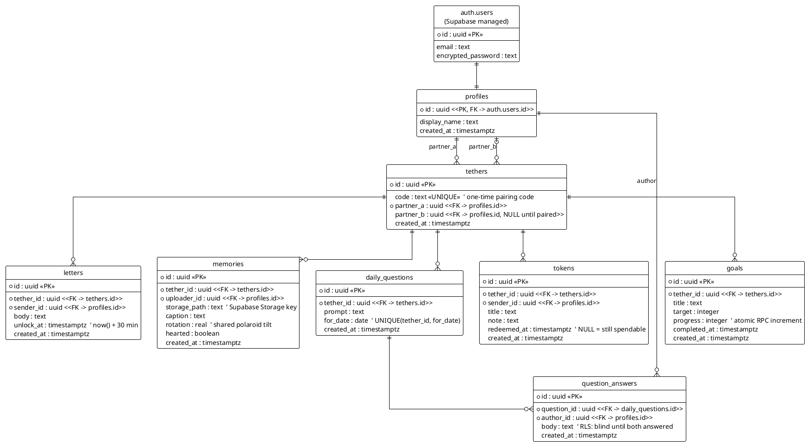

# Tether — System Design & Visual Architecture

Paste either block into [PlantText](https://www.planttext.com/) to render.

## 1. Relational Database Schema (ERD)

**Privacy invariant:** every content table carries `tether_id`; all RLS
policies route through `is_tether_member(tether_id)`, so a couple's rows are
invisible to any other authenticated user. The "blind answer" rule is enforced
in the database (`answers select blind` policy), not just the UI.

## 2. Component Tree & Realtime Data Flow

```plantuml
@startuml
!theme plain
skinparam componentStyle rectangle

package "Supabase Cloud" {
  [PostgreSQL + RLS] as PG
  [Realtime: Presence] as PRES
  [Realtime: Broadcast] as BCAST
  [Realtime: postgres_changes] as PGC
  [Storage: memories bucket] as STOR
  [Auth] as AUTH
}

package "React App" {
  [main.tsx\n(registerSW)] as MAIN
  [App] as APP
  [TetherProvider\n(TetherContext)] as CTX
  [AmbientBackground\n(mesh gradient)] as BG
  [Router (phase machine)\nloading → signed-out → unpaired → paired] as ROUTER
  [AuthScreen] as AUTHS
  [PairingScreen] as PAIR
  package "PairedApp (swipe pager)" {
    [PulseScreen] as PULSE
    [InboxScreen] as INBOX
    [MemoriesScreen] as MEM
    [BridgeScreen] as BRIDGE
    [TokensScreen] as TOK
    [PathScreen] as PATH
  }
  [haptics.ts\nhidden <input switch>] as HAP
}

MAIN --> APP
APP --> CTX
CTX --> ROUTER
CTX --> BG : ambience\n(dormant/present/near)
ROUTER --> AUTHS
ROUTER --> PAIR
ROUTER --> PULSE

CTX <--> AUTH : session
CTX <--> PG : profiles, tethers
CTX <--> PRES : track({lat,lng}) / sync\n→ partnerOnline, partnerNear
CTX <--> BCAST : send/receive "pulse"
CTX --> HAP : haptic("pulse") on receive

PULSE --> CTX : sendPulse()
INBOX <--> PG : letters (30-min unlock)
INBOX <-- PGC : INSERT letters
MEM <--> PG : memories rows
MEM <--> STOR : upload / public URL
MEM <-- PGC : * memories
BRIDGE <--> PG : daily_questions, answers
BRIDGE <-- PGC : INSERT answers
TOK <--> PG : tokens mint/redeem
TOK <-- PGC : * tokens
TOK --> CTX : sendPulse() on redeem
PATH <--> PG : goals + increment_goal RPC
PATH <-- PGC : UPDATE goals
@enduml
```

**Realtime budget (free tier):** one Presence/Broadcast channel per couple
(`tether:{id}`), plus per-screen `postgres_changes` subscriptions that mount
only while their screen is visible. Pulses are pure Broadcast — zero database
writes.

**Ambience state machine:** `dormant` (partner offline, cool slate) →
`present` (partner's presence key visible, warm amber) → `near` (both clients
report coordinates within 250 m, glowing blush). Transitions are 3.5 s
color-tweened by Framer Motion in `AmbientBackground`.
